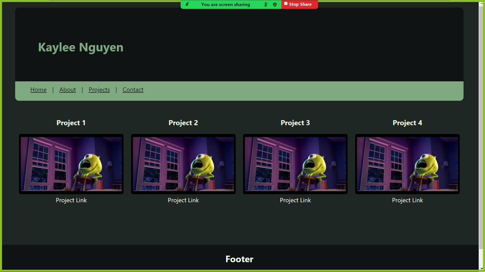

# REACT Portfolio
Module #20

## Project status
Everything is set up to receive information. Everything that exists on the page is a filler and just needs to be filled in with the correct information. 

## Description
Portfolio of my projects using REACT. The user will be able to switch between pages using the navigation bar. 

## Visuals

## Installation
`
$ npx create-react-app .
$ npm start or react-script-start
`

## License
None

